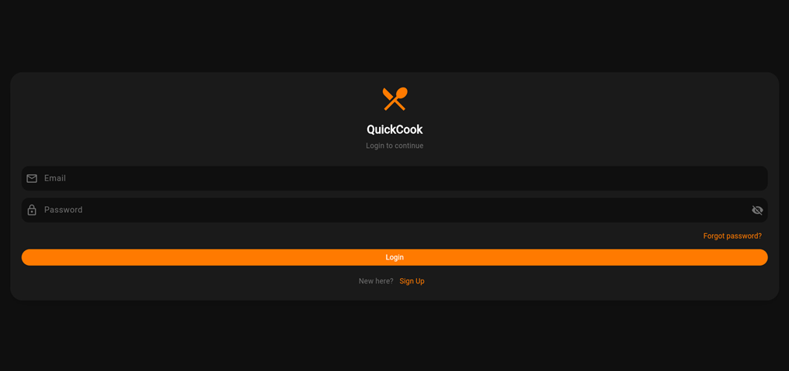
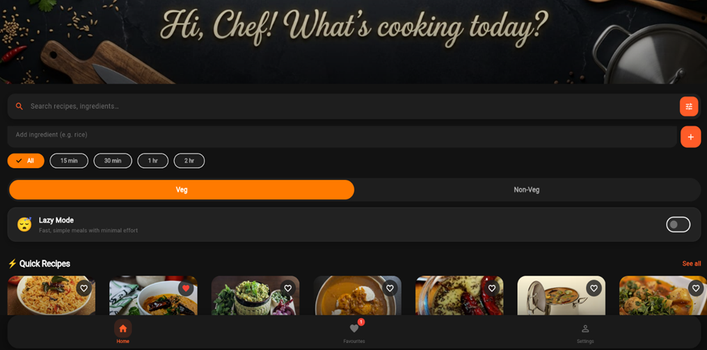
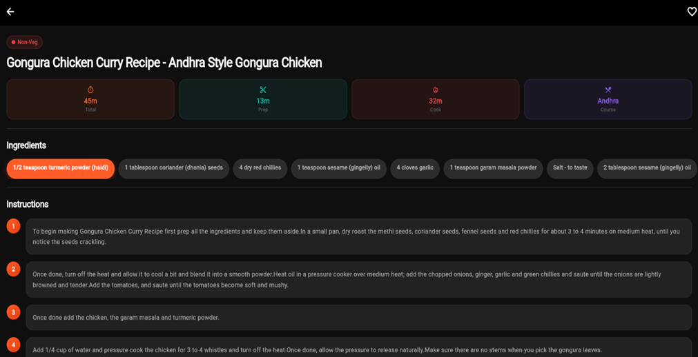
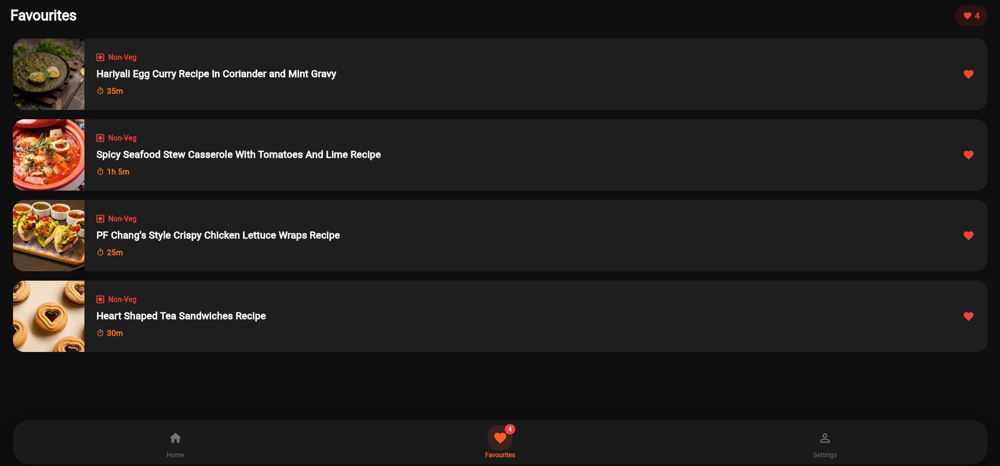
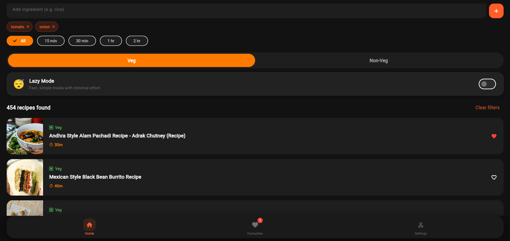

# 🍳 QuickCook — Where Time Meets Taste

> A Flutter-based intelligent recipe discovery app that helps you find the perfect Indian recipe based on your available time, ingredients, and energy level.

QuickCook solves a real daily problem — decision fatigue at mealtime. Instead of scrolling through thousands of recipes, QuickCook filters your options instantly using time constraints, available ingredients, and a *Lazy Mode* for no-cook recipes. 

---
## Screenshots

### 🔐 Authentication
Secure login and signup functionality using Firebase Authentication. Users are automatically redirected after login.

### 🔍 Finding Recipes
Use the search bar to find recipes, apply time filters, enable Lazy Mode, and add ingredients to refine results.

### 📖 Viewing a Recipe
Tap on any recipe to view detailed information including ingredients, step-by-step instructions, and cooking time. You can also save recipes to your favorites.

### ❤️ Favorites
Save your preferred recipes and access them anytime from the Favorites page. Swipe to remove recipes from the list.

### 🥕 Ingredient-Based Filtering
Add ingredients you have to find recipes that match them. Multiple ingredients can be selected to refine results and get more relevant recipe suggestions.

---
## ✨ Features

- *Time-Based Filtering* — Filter recipes by Under 15 min, Under 30 min, Under 1 hour, Under 2 hours, or Any time
- *Ingredient-Based Filtering* — Enter the ingredients you have and get only matching recipes
- *😴 Lazy Mode* — Toggle on to show only no-cook recipes when you don't feel like cooking
- *Real-Time Search* — Search recipes by name instantly with a debounced search bar
- *Favorites* — Save your favourite recipes locally; swipe to remove from favorites
- *Recipe Detail View* — View full ingredients list, step-by-step instructions, and time breakdown (Prep / Cook / Total)
- *Premium UI* — Dark-friendly design with smooth staggered animations, gradient hero banners, and rounded cards
- *Authentication* — Login, Signup, and Auth wrapper screens powered by Firebase Auth
- *Settings Screen* — User preferences and app configuration

---

## 🛠️ Tech Stack

| Layer | Technology |
|---|---|
| Framework | Flutter 3.x |
| Language | Dart (null-safe) |
| State Management | Provider |
| Backend / Auth | Firebase Authentication |
| Database | Cloud Firestore |
| Navigation | Flutter Navigator (Main Shell) |
| UI & Styling | Flutter Widgets, Custom Theme |
| Dataset Processing | Python (csv_to_json.py, add_images.py) |
| Dataset | Indian Food CSV → recipes.json |
---

## 📦 Installation & Setup

### Prerequisites

- Flutter SDK >=3.0.0
- Dart SDK >=3.0.0
- Android Studio / VS Code with Flutter extension
- Firebase project (for Auth and Firestore)
- Python 3 (for dataset preprocessing scripts)

### Steps

*1. Clone the repository*
bash
git clone https://github.com/RaizelNevaDsilva/QuickCook.git
cd quickcook

*2. Install Flutter dependencies*
bash
flutter pub get

*3. Firebase Setup*

- Create a Firebase project at https://console.firebase.google.com  
- Enable *Email/Password Authentication*  
- Enable *Cloud Firestore Database*  
- Download google-services.json and place it in android/app/  
- Update firebase_options.dart with your Firebase configuration

*4. Preprocess the Dataset* (only needed if updating the recipe data)
bash
# Convert CSV to JSON
python scripts/csv_to_json.py

# Add image references to recipes
python scripts/add_images.py

Output is saved to assets/data/recipes.json automatically.

*5. Run the app*
bash
flutter run

*6. Build release APK*
bash
flutter build apk --release

---

## 📁 Folder Structure

quickcook/
│
├── assets/
│   ├── data/
│   │   └── recipes.json              # Preprocessed Indian food dataset
│   └── images/
│       ├── homepage_banner.jpeg      # Home screen hero banner
│       └── quickcook_banner.png      # App branding banner
│
├── lib/
│   ├── main.dart                     # App entry point
│   │
│   ├── models/
│   │   ├── filter_state.dart         # FilterState model + TimeFilter enum
│   │   └── recipe.dart               # Recipe data model 
│   │
│   ├── providers/
│   │   ├── recipe_provider.dart      # Recipe loading, filtering, search logic
│   │   └── theme_provider.dart       # App theme state (light/dark)
│   │
│   ├── screens/
│   │   ├── auth_wrapper.dart         # Auth state gate (login vs home)
│   │   ├── category_results_screen.dart  # Recipes filtered by category
│   │   ├── favorites_screen.dart     # Saved favourite recipes
│   │   ├── home_screen.dart          # Main screen with filters + search
│   │   ├── login_screen.dart         # Firebase login screen
│   │   ├── main_shell.dart           # Bottom nav shell / layout wrapper
│   │   ├── recipe_detail_screen.dart # Full recipe detail view
│   │   ├── settings_screen.dart      # User preferences & settings
│   │   ├── signup_screen.dart        # Firebase signup screen
│   │   └── splash_screen.dart        # Launch splash screen
│   │
│   ├── services/
│   │   ├── auth_service.dart         # Firebase Auth (login, signup, logout)
│   │   └── firestore_service.dart    # Firestore read/write operations
│   │
│   ├── utils/
│   │   ├── app_colors.dart           # Centralized color palette tokens
│   │   └── app_theme.dart            # ThemeData configuration (light/dark)
│   │
│   └── widgets/
│       ├── ingredient_chips.dart     # Dismissible ingredient input chips
│       ├── lazy_mode_card.dart       # Lazy Mode toggle card widget
│       ├── recipe_card.dart          # Reusable recipe list card
│       ├── search_bar_widget.dart    # Animated real-time search bar
│       └── section_header.dart       # Section label / header widget
│
├── scripts/
│   ├── add_images.py                 # Adds image paths to recipe JSON
│   └── csv_to_json.py                # Converts indian_food.csv → recipes.json
│
├── test/
│   └── widget_test.dart              # Basic widget tests
│
├── firebase_options.dart             # FlutterFire generated config
├── firebase.json                     # Firebase project config
├── indian_food.csv                   # Raw dataset (source)
├── indian_food_with_images.csv       # Dataset with image references
├── .env                              # Environment variables (API keys)
├── pubspec.yaml                      # Dependencies & asset declarations
└── analysis_options.yaml             # Dart linting rules

---